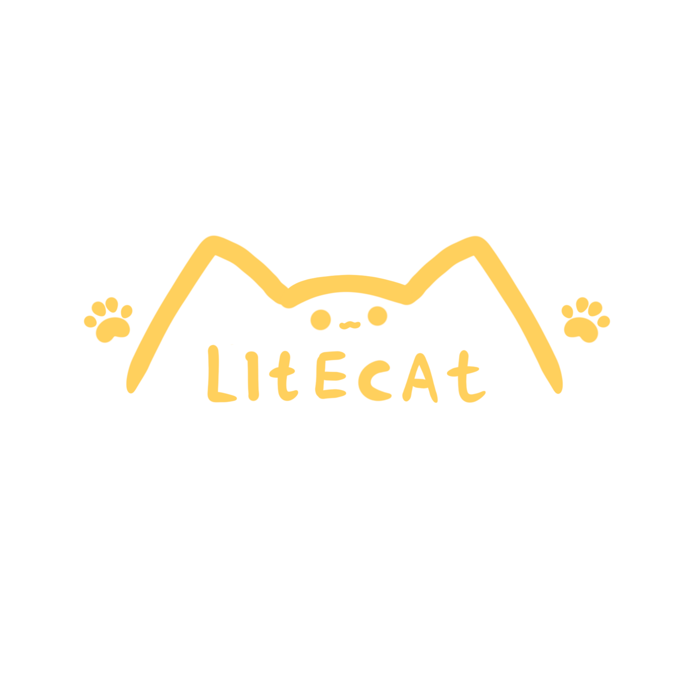

<<<<<<< HEAD
# RTCRAFT 2023 NEW
> 这是我们为了新的服务器「深邃」RPG做的全新的主页


## 打包 / Build
```
npm run build
```
## 开发 / Dev
```
npm i
npm run dev
```
=======
# LiteTools

**在线工具类箱**

## 地址 

新面板地址: [https://lt.litecat.buzz](https://lt.litecat.buzz)

## 如何安装/运行

1. clone本仓库
```shell
git clone https://github.com/LiteCat0905/LiteTools.git
```

2. 安装Nodejs 16x/18x，并运行命令安装
```shell
npm i
```

3. 运行
```shell
npm run dev
```

4. 访问输出的地址，即可访问!

## 相关链接&使用的开源项目
- [Emoji.json『unpkg』](https://unpkg.com/emoji.json@14.0.0/emoji.json)
- [twemoji『Github』](https://github.com/twitter/twemoji)
- [twemoji-amazing『Github』](https://github.com/SebastianAigner/twemoji-amazing)
>>>>>>> 9ca12173c616f1bee61b26b7fe91f67afee72ee2
